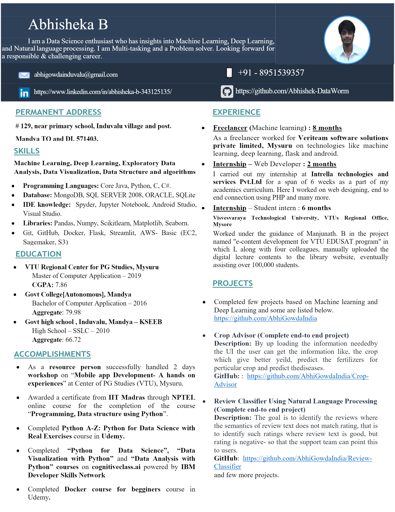

- 👋 Hi, I’m Abhisheka B ( Abhishek-DataWorm).

     An aspiring data scientist, Worked as a freelancer on machine learning tech stack and successfully completed a few courses on data science, have skills like machine learning, deep learning, libraries like scikit- learn, numpy, pandas, Seaborn etc.

- 👀 I’m interested in machine learning, deep learning, Natural language processing, computer vision and many more.
- 🌱 I’m currently learning tools and technologies used in Data science, machine learning and many.
- 💞️ I’m looking to contribute to the data science community and showcase my skills and share my knowledge.
- 📫 How to reach me..
- LinkedIN: https://www.linkedin.com/in/abhisheka-b-343125135/

## Resume

<embed src="/Resume/Resume-latest-5-new.pdf" type="application/pdf" />

<object data="/Resume/Resume-latest-5-new.pdf" type="application/pdf" width="700px" height="700px">
    <embed src="/Resume/Resume-latest-5-new.pdf">
        
Download pdf here: <a href="https://github.com/Abhishek-DataWorm/Abhishek-DataWorm/blob/main/Resume/Resume-latest-5-new.pdf">Download PDF</a>.

    </embed>
</object>

<!---
Abhishek-DataWorm/Abhishek-DataWorm is a ✨ special ✨ repository because its `README.md` (this file) appears on your GitHub profile.
You can click the Preview link to take a look at your changes.
--->
